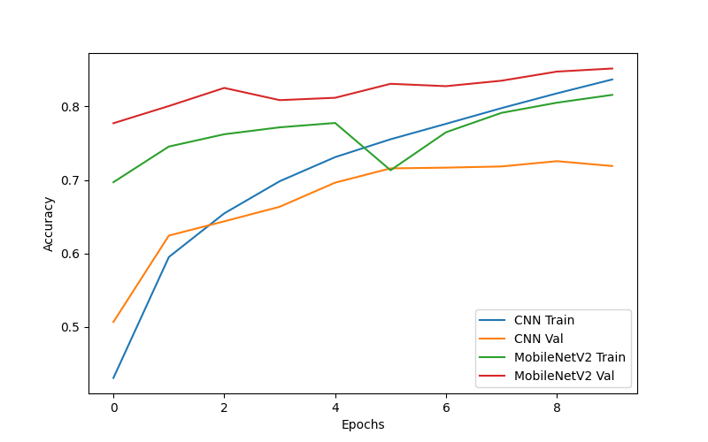
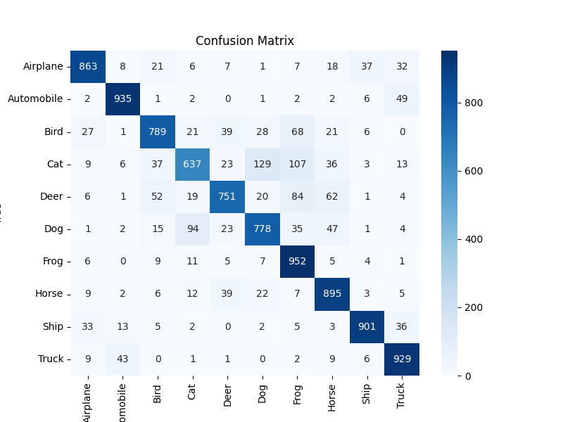
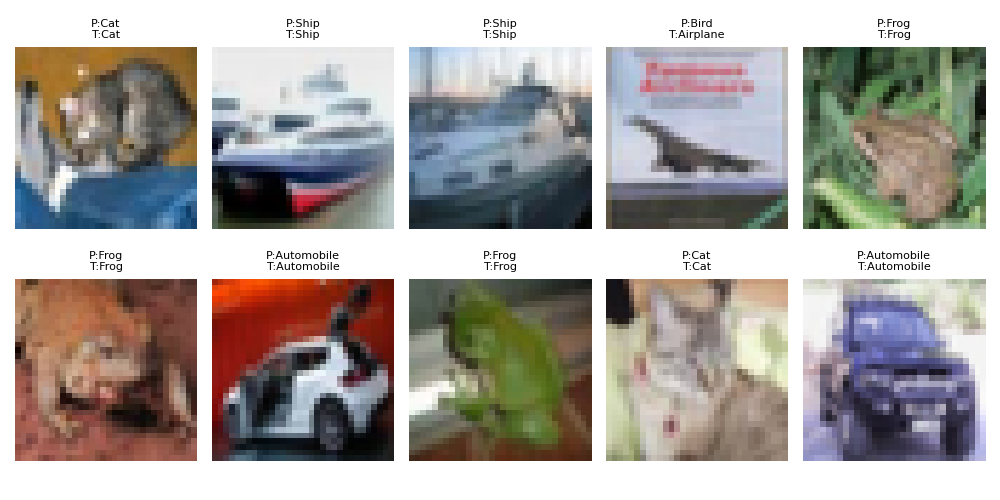

# Vision AI — CIFAR-10 Image Classification

## 📌 Overview
This project is an image classification system trained on the CIFAR-10 dataset using:
- A custom **Convolutional Neural Network (CNN)**
- **MobileNetV2 Transfer Learning** with fine-tuning

It demonstrates skills in image preprocessing, deep learning, evaluation metrics, and transfer learning.

---

## 📊 Dataset
**CIFAR-10** contains 60,000 color images (32×32 pixels) in 10 categories:
`Airplane, Automobile, Bird, Cat, Deer, Dog, Frog, Horse, Ship, Truck`

- **Train:** 45,000 images  
- **Validation:** 5,000 images  
- **Test:** 10,000 images  
- [Dataset Info](https://www.cs.toronto.edu/~kriz/cifar.html)

---

## 🛠 Method
1. **Data Preprocessing**
   - Normalized pixel values to [0, 1]
   - Train/val/test split
   - Data augmentation (rotation, shifts, flips)

2. **Model 1 — Baseline CNN**
   - 3 Conv2D layers + MaxPooling
   - Dense layers for classification
   - Adam optimizer, 10 epochs

3. **Model 2 — MobileNetV2**
   - Pretrained on ImageNet
   - On-the-fly resizing to 160×160
   - Frozen base layers + trained dense head
   - Fine-tuned last 30 layers
   - Adam optimizer (lr=1e-5), 5+5 epochs

---

## 📈 Results
| Model | Val Accuracy | Test Accuracy |
|-------|--------------|---------------|
| Baseline CNN | ~72% | ~72% |
| MobileNetV2 (fine-tuned) | **~85%** | **~84%** |

---

## 📊 Visuals
**Accuracy Curves**  


**Confusion Matrix**  


**Sample Predictions**  


---

## 📂 Project Structure
```
VisionAI_Project/
│── baseline_cnn.keras               # Baseline CNN model
│── mobilenetv2_finetuned.keras      # Fine-tuned MobileNetV2 model
│── accuracy_curves.png              # Accuracy comparison plot
│── confusion_matrix.png              # Confusion matrix
│── sample_predictions.png           # Example predictions
│── VisionAI_Project.ipynb           # Google Colab notebook
│── README.md                        # Project documentation
```

---

## 🚀 How to Run
1. Open `VisionAI_Project.ipynb` in [Google Colab](https://colab.research.google.com/)  
2. Go to **Runtime → Change runtime type → GPU**  
3. Run all cells — models and plots will be generated in `VisionAI_Project` folder

---

## 📄 Presentation
[Download the project slides](VisionAI_Project_Presentation.pdf)

---

## 📚 References
- [TensorFlow](https://www.tensorflow.org/)  
- [Keras Applications](https://keras.io/api/applications/)  
- [CIFAR-10 Dataset](https://www.cs.toronto.edu/~kriz/cifar.html)
